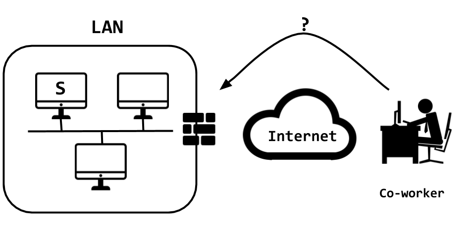
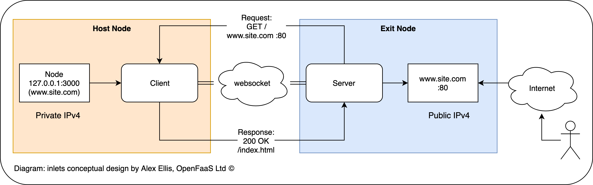

# Compartir su trabajo con sus clientes [Video](https://youtu.be/3UzlB8dkzXI)

## Motivación + Contexto

>
> [Video](https://youtu.be/7dz8S4RqLGk) en este video se explica en que contexto el *tunneling* es una respuesta a la exposición de recursos o servicios que se encuentran en una red de área local.
>
> [Video](https://youtu.be/vL4PRKEtTnU) en este video se explica como Inlets apoya a la materialización del concepto de Tunneling.
>

La motivación de este documento es el de mostrar un mecanismo con el cual se puede __compartir un servicio o un recurso__  con un cliente, jefe o un amigo; a través de Internet.
Pero imagine que ese recurso/servicio se encuentra en una red privada y existen factores externos que dificultan que ese servicio sea expuesto en Internet.



Una solución es seguir un esquema de tunneling. 
En particular se usará un esquema de tunnenling para el protocolo HTTP.

## Inlets, una herramienta para apoyo al proceso de Tunneling

Una herramienta de software que permite este tipo de comunicación se llama [inlets](https://github.com/inlets/inlets).
La idea de inlets se puede ver de manera gráfica en la siguiente imagen:



En este esquema se asocia el cliente de la gráfica (rectángulo rosado) con el servicio que se quiere compartir con el jefe o colega. 
Ese cliente se le llama así en este contexto porque él deberá conectarse con un servidor (**server** en rectángulo azul) que se conocerá como el *Exit Node*. 
Este será el nodo que le permitirá salir al servicio del cliente hacia Internet. 
Observe que el *Exit Node* (rectángulo azul) tiene un IP público, lo que quiere decir, que el podrá ser accedido por cualquier persona en Internet. 

Es posible que usted tenga un servicio o un recurso que le gustaría compartir en Internet usando **inlets**. 
¿Dónde se deberá ubicar este *Exit Node* para que tenga un IP público? Pues lo más sencillo es que ese servidor se ubique en un proveedor de infraestructura en la nube como por ejemplo: Digital Ocean, Amazon Web Services (AWS), Google Cloud Platform (GCP) o Windows Azure.

Existen muchos ejemplos de *inlets* en Internet usando como proveedor de infraestructura Digital Ocean.
Sin embargo, aquí se usará GCP. 
La forma como se lleva a cabo el despliegue de este *Exit Node* en GCP se encuentra en este [enlace](https://pretired.dazwilkin.com/posts/200122/).  
Lo que se hizo fue el programar la mayor cantidad de tareas de modo que usted pueda seguir este tutorial con el menor número de problemas posibles.

## Manos a la obra

### Requerimientos

Para llevar a cabo esta práctica se necesita tener una cuenta en Google y tener registrado alguna forma de pago dado el caso que un exceso a los recursos que se ofrecen en GCP requiera ser cobrado. 

> Vale la pena aclarar que lo mismo sucede con Digital Ocean. 
> Para poder tener una cuenta en Digital Ocean se requiere proveer un medio de pago. :disappointed:

Una vez se tengan los requerimientos se pasa a crear el *Exit Node* en GCP.

### Descargar este repositorio

Para llevar a cabo esta práctica, abra una terminal y ejecute el siguiente comando:

```
git clone https://github.com/josanabr/tunneling-inlets.git
```

### Crear la máquina virtual

Para esta práctica se creará una máquina virtual con todas las dependencias que se requieren en este taller. 
Ingrese al directorio `tunneling-inlets`:

```
cd tunneling-inlets
```

Ejecute el siguiente comando:

```
vagrant up
```

> Y puede ir a preparase un :coffee:. [Aquí](https://youtu.be/VXjQxD-Kqu0) un :movie_camera: de la ejecución del comando.

El siguiente paso en el proceso es crear el *Exit Node* en la plataforma GCP.

### Creando el *Exit Node* de inlets [Video](https://youtu.be/IZ4arr-wePg)
Para crear este *Exit Node* se debe ingresar a la máquina virtual:

```
vagrant ssh 
```

>
> Una vez esté al interior de la máquina virtual debe inicializar la aplicación `gcloud` [Video](https://youtu.be/5REPG3IuDIM)
> 

Una vez dentro de la máquina virtual, [**lleve los pasos descritos en este video**](https://youtu.be/HsUD3Tz8L1s) para asociar el aplicativo `gcloud` con una cuenta en Google.

Una vez inicializado el aplicativo `gcloud`, se ejecutará el siguiente script:

```
/vagrant/GCP/crear-inlets-exit-node.sh
```

Este script como su nombre lo sugiere se encarga de crear el *Exit Node* en GCP.

A continuación se describirá lo que hace el script:

* Línea 1 - 4: Se crea el proyecto con nombre indicado en la variable `${PROJECT}`.

* Línea 5 - 6: Se identifica la cuenta de donde se podrá cobrar si se llega a algún exceso en el uso de recursos provistos por GCP. Se enlaza esa cuenta con el proyeco recién creado.

* Línea 8: Se habilita el servicio `compute` de GCP. Este servicio permite crear instancias de máquinas virtuales o contenedores en GCP.

* Líneas 10 - 28: Se crea un contenedor en GCP quien hará las veces de *Exit Node*. Este contenedor será el encargado de servir de mediador entre el servicio en su red área local y un usuario de Internet. A continuación se resaltarán algunos elementos que permiten la creación de este contenedor.

  * Línea 12: En esta línea se define una variable llamada `DIGEST`. Esta variable contiene el identificador de una imagen de Docker que se encuentra en Docker Hub. En este caso particular el valor exhibido corresponde a [una imagen de un contenedor en Docker Hub](https://hub.docker.com/layers/inlets/inlets/2.7.0-1-geffb735/images/sha256-e1ae8711fa5a7ee30bf577d665a7a91bfe35556f83264c06896765d75b84a990?context=explore) que tiene el aplicativo **inlets** desplegado en el.

  * Línea 13: En esta línea se inicializa la variable `PORT`. Este será el puerto que expondrá el *Exit Node* para que usuarios de Internet puedan acceder a través de él al servicio que se encuentra en su red de área local.

  * Línea 14: Esta línea define la variable `TOKEN`. El valor con el que se inicializa la variable es un número aleatorio al cual se le aplica la función de hash `sha256`. Este valor se puede entender como un santo y seña para que el servicio en la red de área local a la hora de conectarse, lo presente al *Exit Node* y este acepte su petición de conexión.

* Línea 33 - 37: En estas líneas se guarda en la variable `IP`, el cual es el IP público del contenedor creado anteriormente.

* Línea 38 - 44: Se identifican aquellos usuarios de la plataforma GCP que tienen capacidad para gestionar el acceso a recursos. Por ejemplo: que usuarios pueden modificar las reglas de *firewall*.

* Línea 47 - 54: Se crea una regla en el firewall del proyecto la cual permite conectarse al contenedor por el puerto definido por la variable `PORT` (línea 52). 

* Línea 57 - 64: Se presenta un mensaje por pantalla indicando algunas variables que se requieren para ejecutar el cliente de inlets que se comunicará con el contenedor que está en GCP.

### Corriendo el servicio que desea exponer [Video](https://youtu.be/icTGC2kgbDk)

En la clase anterior se trabajó un ejemplo de un web service que permitía el acceso a un *to do list*. 
Se ha creado un contenedor con el aplicativo visto en la clase anterior. 
Esta imagen de contenedor se encuentra en `josanabr/gtd-flask-app`.
Para llevar a cabo la ejecución de esta aplicación usted deberá correr el siguiente comando:

```
/vagrant/correr-gtd-app.sh
```

Una vez ejecutado este comando usted podrá validar que el servicio está corriendo si ejecuta el siguiente comando:

```
curl http://localhost:5000
```

Debería aparecer en pantalla un saludo en inglés.

### Ejecutando el cliente inlets [Video](https://youtu.be/F61dt-aBDn8)

Hasta este punto usted ya tiene un *Exit Node* en GCP y tiene un servicio que desea exponer a los usuarios en Internet, el gestor de *to do list*.
A continuación se ejecutará el servicio que pegará a estos procesos, uno corriendo en GCP y el otro en su infraestructura local.

Recuerde por un momento que al finalizar la ejecución del script `/vagrant/GCP/crear-inlets-exit-node.sh`, script que crea un contenedor en GCP para que sirva de *Exit Node*, se imprimieron una serie de variables.
En particular las variables impresas fueron: `REMOTE`, `TOKEN`, `DIGEST`.
Los valores al frente de las variables escríbalos en el script `/vagrant/GCP/correr-cliente-inlets.sh`. 
Una vez modifique el script y guarde los cambios proceda a ejecutarlo.

```
/vagrant/GCP/correr-cliente-inlets.sh
```

Una vez haya finalizado la ejecución del script anterior entonces usted se podrá acceder al servicio local a través de inlets desplegado en GCP.

### Prueba del servicio [Video](https://youtu.be/Eya21E24P-g)

Para evidenciar que el aplicativo local se puede acceder remotamente y que el servicio accedido remotamente es el mismo local se llevarán a cabo las siguientes actividades.

> **Recuerde** que el valor de la variable `REMOTE` lo proporcionó el script `crear-inlets-exit-node.sh` al finalizar su ejecución.

* Estando en una terminal dentro de la máquina virtual, ejecute lo siguiente:

```
curl http://localhost:5000/todo/api/v1.0/tasks
```

Debería obtener una salida por pantalla similar a esta:

```
{
  "tasks": [
    {
      "description": "Milk, cheese, pizaa", 
      "done": false, 
      "id": 1, 
      "title": "Buy groceries"
    }, 
    {
      "description": "Need a good tutorial on the web", 
      "done": false, 
      "id": 2, 
      "title": "Learn Python"
    }
  ]
}
```

* Ahora se creará una tarea __pero accediendo__ a través de inlets desplegado en GCP:

```
curl -X POST -d '{ "title": "write a book" }' -H "Content-type: application/json" http://${REMOTE}/todo/api/v1.0/tasks
```

Debería obtener una salida por pantalla similar a esta:

```
{
  "task": {
    "description": "", 
    "done": false, 
    "id": 3, 
    "title": "write a book"
  }
}
```

* Finalmente se hará una consulta al servicio local para validar que la nueva tarea fue creada:

```
curl http://localhost:5000/todo/api/v1.0/tasks
```

Debería obtener una salida por pantalla similar a esta:

```
{
  "tasks": [
    {
      "description": "Milk, cheese, pizaa", 
      "done": false, 
      "id": 1, 
      "title": "Buy groceries"
    }, 
    {
      "description": "Need a good tutorial on the web", 
      "done": false, 
      "id": 2, 
      "title": "Learn Python"
    }, 
    {
      "description": "", 
      "done": false, 
      "id": 3, 
      "title": "write a book"
    }
  ]
}
```
---

## Webgrafía

* [Setting up a GCE Instance as an Inlets Exit Node](https://pretired.dazwilkin.com/posts/200122/) - de este enlace me basé para hacer los scripts presentados en esta guía.

* [Exploring NAT Traversal and Tunnels with Inlets and Inlets Pro](https://blog.heyal.co.uk/inlets-pro/) En este tutorial no solo se muestra en operación **inlets** sino también **inlets pro** el cual permite hacer conexiones TCP.

* [https://itnext.io/get-started-with-free-http-and-websocket-tunnels-30c9ac3fd247](https://itnext.io/get-started-with-free-http-and-websocket-tunnels-30c9ac3fd247) Un tutorial sencillo para hacer uso de **inlets** en la plataforma de Digital Ocean. 

* [Share work with clients using inlets](https://blog.alexellis.io/share-work-using-inlets/) Este es un ejemplo de un aplicativo escrito en Node.js y que usa también a Digital Ocean para desplegar a **inlets**.
